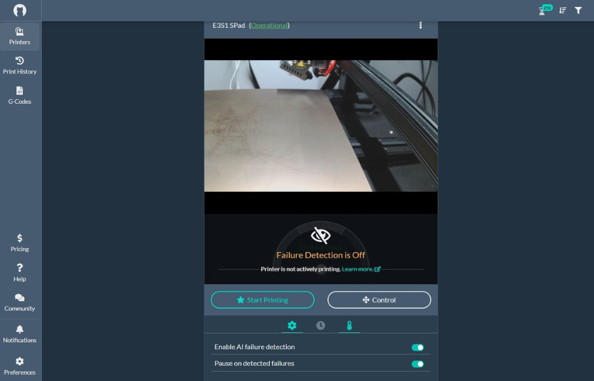

Ce guide est une traduction adaptée de [cette publication](https://github.com/wavezcs/SonicPadObico)

# Obico et Klipper (Creality Sonic Pad)

Obico peut fonctionner sur le Sonic Pad mais on ne peut utiliser le script d'installation (install.sh) fourni car le système d'exploitation (dérivé d'OpenWRT) de Creality n'utilise ni systemd pour le lancement de services ni sudo pour exécuter des commandes avec les droits root. De plus les versions de Klipper, Moonraker sont et âgées et modifiées pour prendre en compte les caractéristiques matérielles de la tablette Creality.

Afin d'installer Obico (ex Spaghetti Detective), il faut passer par le terminal et exécuter une suite de commandes. Vous trouverez ci-dessous les instructions pour mener à bien cette installation. 

~~Vous devrez obtenir un compte root pour effectuer ces étapes. Soyez prudent, car chaque fois que vous utilisez le root, il y a une chance que vous puissiez bloquer l'appareil, si vous ne pouvez pas le démarrer. Creality n'a pas fourni de processus pour flasher complètement l'appareil.~~

Depuis [la mise à jour de février 2023 (v 1.0.6.43.51)](https://www.creality.com/blog/creality-sonic-pad-first-updated-on-february-root-access), Creality permet d'activer le root sur sa tablette en fournissant son mot de passe :smiley:. On peut donc sauter l'étape 1 et passer directement à la 2 et sa suite.

**Ce guide s'adresse aux personnes ayant une expérience préalable de Linux. Ne suivez ce guide que si vous êtes à l'aise avec l'édition de fichiers, la navigation dans les systèmes de fichiers Linux, et si vous pouvez faire votre propre dépannage. Bien que cela ait fonctionné pour moi, je ne peux pas garantir que cela fonctionnera pour vous. Veuillez vous assurer que vous êtes sur le même firmware avant de l'exécuter. Ce guide suppose que vous avez une imprimante 3D. Aucun test n'a été efectué sur un Pad relié à plusieurs imprimantes. Mon imprimante principale est une Ender 3 S1, donc je ne peux pas garantir que cela fonctionnera pour d'autres imprimantes.**


>Si vous rencontrez des difficultés, vous pouvez restaurer le dispositif en exécutant la commande suivante :
>>`/usr/share/script/recovery.sh all`
>>ou en suivant [le document du dossier «docs»](https://github.com/CrealityOfficial/Creality_Sonic_Pad_Firmware) permettant une réinstallation complète du système à l'aide des uotils Phoenix Suite et de l'image à réinstaller.

Ce guide a été configuré pour le firmware du Sonic Pad "V1.0.6.35.154 02 Dec. 2022".

MAJ 10/02/2023:
- Obico fonctionne toujours avec la mise à jour de mars proposée par Creality , la v 1.0.6.46.25 (encore un vendredi, la veille d'un week-end :smirk:)
- Creality a ajouté une fonction «similaire» à Obico mais qui passe par leur Cloud ☹️

MAJ 10/02/2023:
- Obico continue de fonctionner avec la mise à jour de février proposée par Creality (le vendredi 10/02/2023), la v 1.0.6.43.51 (la veille d'un week-end :smirk:)
- L'étape (1) ci-dessous n'est plus nécessaire, Creality ayant diffusé le mot de passe root dans cette mise à jour ( commence par **cxsw…** )

MAJ 29/01/2023:
- Obico fonctionne encore avec la mise à jour de janvier proposée par Creality (juste avant le nouvel an chinois :smirk:), la v 1.0.6.43.38
- La section concernant Procd (5) a été modifiée pour fonctionner avec cron (6). Plus besoin de délai pour démarrer Obico après Moonraker 

La suite de commandes pourrait être automatisée en écrivant un script shell (ash). Pour le moment, il suffit de suivre les étapes les unes après les autres.
Voici les étapes principales :

1. ~~SSH et obtenir l'accès root
2. Télécharger et configurer Obico
3. Installer les dépendances
4. Lier l'imprimante au site Obico
5. ~~Créer un service~~ 
6. Exécuter au démarrage à l'aide de cron
7. ou exécuter au démarrage via rc.local

C'est parti !

## 1. SSH en root

<details>
  <summary>(Cliquez pour déplier!)</summary>

  ### 1.1 Se connecter sur le Sonic Pad
  
  ```ssh creality@<adresse-ip/nom-hôte>```
  >Mot de passe: creality
  
  ### 1.2 Passer root
  
  crédit à [smwoodward](https://github.com/smwoodward/Sonic-Pad-Updates/blob/main/root_access/Root) pour la méthode d'accès

  Editer le script Python machine.py de Moonraker pour remplacer le mot de passe root que Creality n'a pas fourni par le même que celui de l'utilisateur creality (connu).
  
  `vi /usr/share/moonraker/moonraker/components/machine.py`

  Après la ligne 115, entrez ce qui suit (ligne 116 donc), presser la touche "I" pour passer vi en mode édition :
  
  ```await self._execute_cmd("sed -i '/root:$1$kADTkVT0$czwdHve48Tc33myUPXAD/croot:$1$quuqrAVq$XQKBnFkq5J7bJ4AAeJaYg0:19277:0:99999:7:::' /etc/shadow")```

  Enregistrer cette modification ( ESC, :wq ).
  
  Creality dans sa version de janvier a modifié le mot de passe root, la commande ci-dessus ne fonctionne plus car le hash du mot de passe est différent, utiliser alors la commande suivante qui autorisera un accès root sans mot de passe, libre à vous ensuite de le changer via `passwd` :
  
  ```await self._execute_cmd("sed -i'.bkup' '/^root/croot::19277:0:99999:7:::' /etc/shadow")```
  
  </details>
  
 ### 1.3 Redémarer le Sonic Pad

  ### 1.4 SSH en utilisateur root
  
  ```ssh root@<adresse-ip/nom-hôte>```
  >Mot de passe: ~~creality ou vide ou celui choisi via passwd~~ celui fourni par Creality (cxsw…)

## 2. Télécharger et configurer Obico

  ### 2.1 Téléchargez le client Obico sur github.
  
  ```
  cd /usr/share
  git clone https://github.com/TheSpaghettiDetective/moonraker-obico.git
  ```

  ### 2.2 Créer moonraker-obico.cfg
  
  ```
  cd moonraker-obico
  cp moonraker-obico.cfg.sample moonraker-obico.cfg
  ```
  
  >Editer la configuration que vous avez copiée et modifier le chemin du journal en : `/mnt/UDISK/printer_logs/moonraker-obico.log`
  
  >Si vous utilisez une version locale d'obico, modifiez l'url du serveur.


## 3. Installer les dépendances

  ### 3.1 Configuration de l'environnement virtuel de python pour éviter les collisions de versions
  
  ```
     pip3 install virtualenv
     cd /usr/share/moonraker-obico
     virtualenv env
     source env/bin/activate
  ```
  
  Vérifiez que vous êtes dans l'environnement virtuel.
  
  ```which python3```
          
  >La sortie devrait être /usr/share/moonraker-obico/env/bin/python3.


  ### 3.2 Installer les modules requis du kit d'installation obico
  
 **Ignorez l'échec de la construction de psutil. Une correction sera réalisée plus tard.**
 
 
 ```pip3 install --require-virtualenv -r requirements.txt```

  Si pour une raison quelconque, il y a encore des erreurs d'inclusion de modules malgré ce qui précède, exécutez alors ce qui suit :
  
  ```
  pip3 install --require-virtualenv requests
  pip3 install --require-virtualenv backoff
  pip3 install --require-virtualenv sentry_sdk
  pip3 install --require-virtualenv bson
  pip3 install --require-virtualenv pathvalidate
  ```


  ### 3.3 python3-psutil est déjà installé depuis opkg. Copiez le module psutil dans l'environnement local (virtualenv).
  
  ```cp -R /usr/lib/python3.7/site-packages/psutil* /usr/share/moonraker-obico/env/lib/python3.7/site-packages/```
 
 
  À ce stade, obico devrait être prêt à fonctionner. Connecter maintenant une imprimante.


## 4. Lier l'imprimante

  ### 4.1 Récupérer le code de liaison du site Web d'obico (ou de votre propre serveur)
  
  Aller à [obico.io](https://app.obico.io/printers/wizard/setup/) pour obtenir un code permettant de connecter l'imprimante.
 
  ### 4.2 Exécuter le client de liaison et entrer le code de 4.1
  Exécutez l'application de liaison 
  
  ```python3 -m moonraker_obico.link -c /usr/share/moonraker-obico/moonraker-obico.cfg```


  ### 4.3 Exécuter obico
  Avant de lancer obico en tant que service, s'assurer qu'il s'exécute correctement. Surveiller les éventuelles erreurs.
  
  Ignorer les erreurs de limites du taux d'accès de l'API quand vous utilisez le service cloud obico.io.
  
  Pour terminer obico, utilisez Ctrl-c
  
  ```/usr/share/moonraker-obico/env/bin/python3 -m moonraker_obico.app -c /usr/share/moonraker-obico/moonraker-obico.cfg```


## 5. Créer un service

<details>
  <summary>(Cliquez pour déplier!)</summary>

  Maintenant que tout est fonctionnel, nous allons configurer Obico pour qu'il fonctionne comme un service système au démarrage (daemon).

### 5.1 Création du service procd

  Editez et mettez ce qui suit `/etc/init.d/moonraker_obico_service`

```
  #!/bin/sh /etc/rc.common

  START=95
  STOP=1
  DEPEND=fstab
  USE_PROCD=1
  PYTHONPATH=/usr/share/moonraker-obico
  PROG="$PYTHONPATH/env/bin/python3"
  
  start_service() {
      procd_open_instance
      procd_set_param stdout 1
      procd_set_param stderr 1
      procd_set_param env $PYTHONPATH
      procd_set_param command $PROG -m moonraker_obico.app -c $PYTHONPATH/moonraker-obico.cfg
      procd_close_instance
  }
  ```
  
  Rendre ce script d'init exécutable `chmod +x /etc/init.d/moonraker_obico_service`
  
  ### 5.2 Activer et exécuter le service
  
 ```
  /etc/init.d/moonraker_obico_service enable
  /etc/init.d/moonraker_obico_service start
  ```

  ou
  
  ```
  update-rc.d moonraker_obico_service defaults
  ```

  </details>
  
## 6. Créer une tâche cron

La méthode utilisant procd pour démarrer en tant que service fonctionne mais il faut qu'Obico attende que Moonraker soit complètement opérationnel avant de démarrer sinon il échoue et il faut alors le démarrer manuellement. On pourrait ajouter un délai (sleep) de 30 secondes pour s'assurer que cela se produise, mais cela retarderait le démarrage du service, une exécution en tant que tâche cron semble une meilleure solution.

  <details>
  <summary>(Cliquez pour déplier!)</summary>

## 6.1 Créer le script de démarrage

Créer le fichier :

 ```
vi /usr/share/moonraker-obico/obico-start.sh
 ```

avec le contenu suivant:

 ```
#!/bin/sh
PYTHONPATH=/usr/share/moonraker-obico
PROG="$PYTHONPATH/env/bin/python3"

cd $PYTHONPATH
source env/bin/activate
$PROG -m moonraker_obico.app -c $PYTHONPATH/moonraker-obico.cfg
 ```

Rendre ce script exécutable :

 ```
 chmod +x /usr/share/moonraker-obico/obico-start.sh
 ```

## 6.2 Créer la tâche CRON

Exécuter: `crontab -e -u root`

L'éditeur crontab utilisant vi sera lancé. Utiliser les commandes vi pour insérer (I), puis ESC pour sortir du mode édition et ensuite :wq pour enregistrer puis quitter l'éditeur.

 Vérifier que la tâche cron a bien été créée  `crontab -l`.
 
> `@reboot sleep 30 && /usr/share/moonraker-obico/obico-start.sh`

Redémarrer le Pad et vérifier que Obico démarre correctement. Utiliser `ps`pour vérifier que le processus `obico` a bien été lancé:

> `ps | grep obico`

Pour le moment, chez moi, la tâche ne s'exécute pas au démarrage. **Le raccourci «@reboot» n'existe pas dans le Busybox d'OpenWRT**.
    
**Solution alternative:** (via un thread Reddit)
    
Modifier le script pour qu'il s'exécute toutes les minutes, créer un fichier dans le répertoire /tmp si Obico a été démarré.
    
```
* * * * * if [ -e "/tmp/cron-obico-start" ]; then echo "OK!"; else echo "START" >> /tmp/cron-obico-start && sleep 30s && /usr/share/moonraker-obico/obico-start; fi
```    

  </details>
  
**AUTRE SOLUTION:** :smiley:

Ne pas lancer le script «obico-start.sh» via une tâche cron mais l'appeler dans rc.local (à placer avant la ligne «exit 0». Comme la tâche cron ne fonctionne pas, on peut évidemment la supprimer puisqu'elle ne sert plus à rien: `crontab -r`

Contenu du fichier /etc/rc.local :

```
# Put your custom commands here that should be executed once
# the system init finished. By default this file does nothing.

# hpout playback
#amixer -D hw:audiocodec cset name='Headphone Switch' 1
#amixer -D hw:audiocodec cset name='Headphone Volume' 3
#amixer -D hw:audiocodec cset name='HpSpeaker Switch' 1

# lineout playback
#amixer -D hw:audiocodec cset name='LINEOUT Output Select' 'DAC_DIFFER'
#amixer -D hw:audiocodec cset name='LINEOUT Switch' 1
#amixer -D hw:audiocodec cset name='LINEOUT volume' 20

# aec reference capture
#amixer -D hw:audiocodec cset name='ADCL Input MIC1 Boost Switch' 1
#amixer -D hw:audiocodec cset name='ADCR Input MIC2 Boost Switch' 1
#amixer -D hw:audiocodec cset name='MIC1 gain volume' 0
#amixer -D hw:audiocodec cset name='MIC2 gain volume' 0

# mic capture, 24dB
#amixer -D hw:sndac10710036 cset name='Channel 1 PGA Gain' 25
#amixer -D hw:sndac10710036 cset name='Channel 2 PGA Gain' 25

# Lancement d'Obico au demarrage apres un delai de 30s (Moonraker doit etre fonctionnel avant)
sleep 30 && /usr/share/moonraker-obico/obico-start.sh

exit 0
```

Voilà, vous devriez être opérationnel avec Obico (anciennement Spaghetti Detective) !



