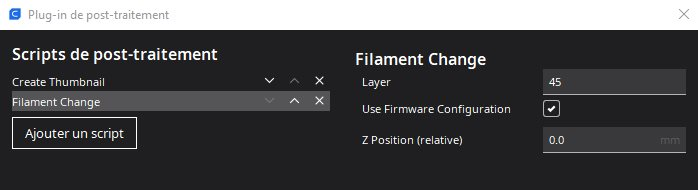
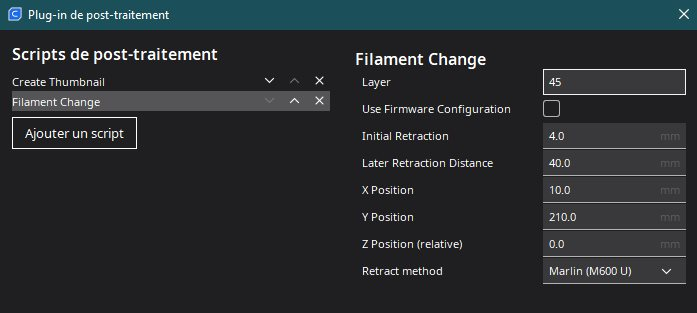

La mise à jour de mars 2023 a ajouté une pseudo macro M600 à la sauce Creality: au lieu de proposer une macro à la manière de ce que fait
Klipper, cette «fonction» a été implémentée logiciellement sur la tablette.

Si une macro M600 existait, elle provoque une erreur (key 57) et empêche le démarrage de Klipper tant que ce conflit n'est pas résolu 😮‍

Si l'on souhaite garder sa propre conception de la macro M600, le plus simple est de «désactiver» le M600-Creality en ajoutant, par exemple :
`rename_existing: M600.1` 

Ma macro M600 actuelle (appelle d'autres macros 😏 ) :
```
[gcode_macro M600]
description: Starts process of Filament Change
rename_existing: M600.1
gcode:
  
    {action_respond_info("Extruder temperature too low")}
  
    PAUSE_MACRO
    _DISABLE_FS
    UNLOAD_FILAMENT
  
```
 Sinon, il faut commenter (ou supprimer) toute la section `gcode_macro M600`
 
 Pour que cette macro M600 ne provoque pas d'erreur `max_extrude…`, il faut s'assurer que l'extrudeur utilise une extrusion relative ( M83 ) et
 pas absolue.
 
 Avec Cura, pour que la tablette réagisse lors de la pause / changement / chargement de filament, ajouter un script de post-traitement,
 Filament Change et cocher l'option «Use Firmware Configuration».
 


 Ainsi il n'y a pas besoin de modifier / indiquer les autres valeurs (rétraction, …) :
 

