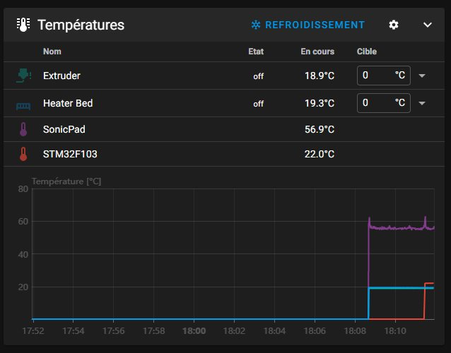
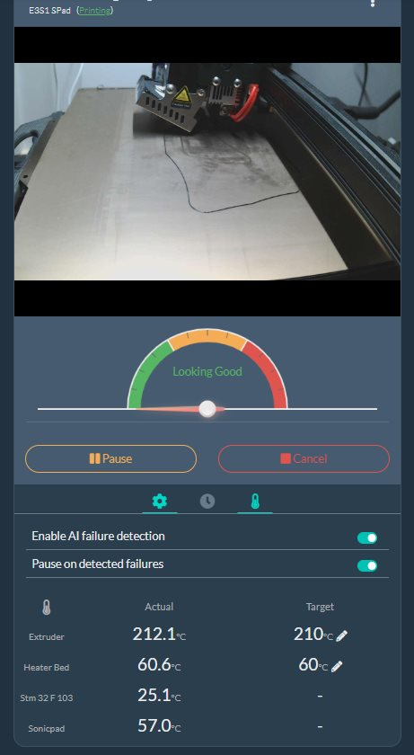

Il est possible d'afficher les températures de la tablette et du microcontrôleur (MCU) de la carte de l'imprimante (uniquement pour des 
cartes 32 bits équipées de à base de μcontrôleurs: ATSAM, ATSAMD, et STM32 
=> voir [ici](https://www.klipper3d.org/fr/Config_Reference.html#capteur-de-temperature-integre-au-microcontroleur) )

Ajouter dans le printer.cfg :
```
#==================  Temperatures host + μcontroler =================
[temperature_sensor SonicPad]
sensor_type: temperature_host
min_temp: 10
max_temp: 75

[temperature_sensor STM32F103]
sensor_type: temperature_mcu
min_temp: 10
max_temp: 75
```

Ce qui donne :


Si Obico a été installé :


**ATTENTION**
Les températures du MCU ne s'afficheront pas avec les microcontrôleurs Gigadrive (GD32…). La cause provient de la version de Klipper
installée sur le SonicPad: trop ancienne alors que des correctifs ont été réalisés 🤤. Si l'on pouvait aisément faire évoluer la version
de Klipper, ce serait résolu, voir [github1](https://github.com/FYSETC/FYSETC-Cheetah-v2/issues/5) et [pour les STM32F401](https://github.com/Klipper3d/klipper/pull/5572)

C'est le ««gros» problème de la tablette Creality, basée sur des versions datées de Klipper, Moonraker difficiles à faire évoluer sans tout casser sur ce matériel et dont l'OS ne permet pas d'ajouter de logiciels via «opkg» (gcc par exemple).
