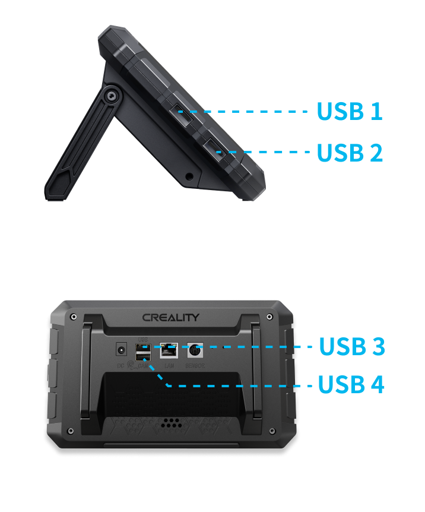

La tablette possède quatre ports USB: 
- deux sur le côté gauche,
- deux à l'arrière :

Creality a renommé les périphériques USB pour inclure le numéro du port USB, probablement pour «unifier» le chemin d'accès au «mcu» des fichiers printer.cfg lors de l'utilisation de plusieurs imprimante connectées sur le SP.

De la forme:
`/dev/serial/by-id/usb_serial_1` pour le port USB1. etc.
